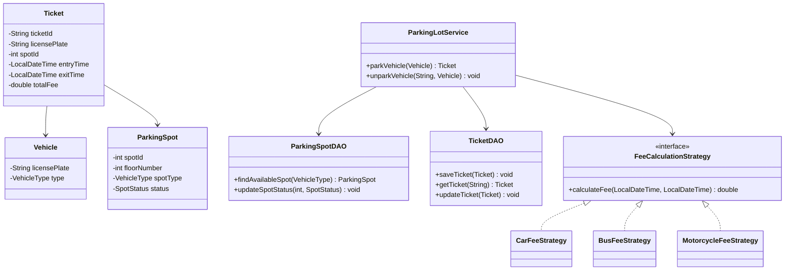

# Smart Parking Lot System (LLD)

This is a backend implementation of a Smart Parking Lot system, built with Java and raw JDBC. It focuses on clean Low-Level Design (LLD), object-oriented principles, and modular architecture.

## Tech Stack
* **Language:** Java 17
* **Database:** MySQL 8.x
* **Build Tool:** Maven
* **Persistence:** Raw JDBC (No ORM/Hibernate)

## Features
* **Dynamic Spot Allocation:** Assigns spots based on vehicle type (Motorcycle, Car, Bus).
* **Automated Fee Calculation:** Implements dynamic pricing rules depending on the duration of stay and vehicle category.
* **Real-time State Management:** Updates parking spot availability instantly upon check-in and check-out.

## Engineering Principles Used
* **SOLID Principles:** High cohesion and low coupling through strict adherence to SRP and OCP.
* **Strategy Pattern:** `FeeCalculationStrategy` allows for easily plugging in new pricing models without modifying core logic.
* **Factory Pattern:** `VehicleFactory` isolates vehicle creation logic.
* **DAO Pattern:** Abstracted database operations to separate persistence from business rules.
* **Singleton Pattern:** Manages the MySQL JDBC connection pool efficiently.

## Prerequisites
* Java 17+
* Maven
* MySQL Server

## Setup Instructions
1. Execute the SQL script located at `src/main/resources/schema.sql` in your MySQL environment to build the database tables and seed the historical/test data.
2. Open `src/main/java/com/gokul/config/DatabaseConnectionManager.java` and update the `PASSWORD` variable to match your local MySQL root password.
3. Load the Maven project to download the MySQL Connector/J dependency.
4. Run the `main` method in `src/main/java/com/gokul/Main.java` to execute the end-to-end check-in and check-out simulation.

## System Architecture

